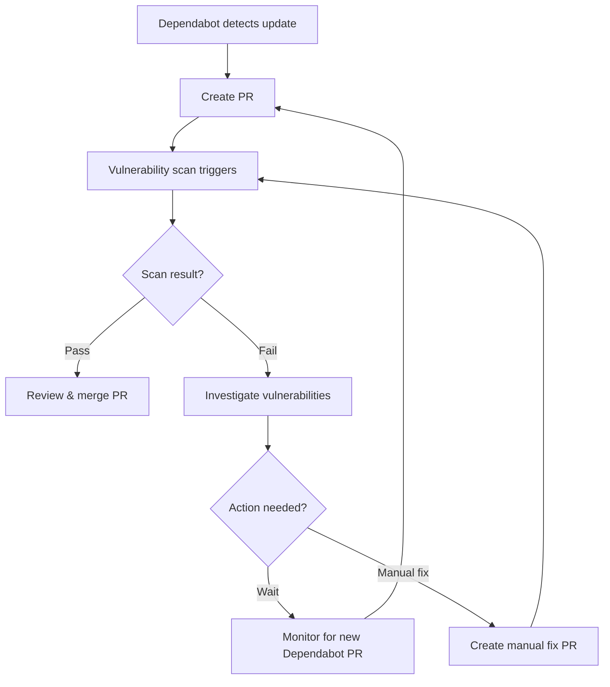
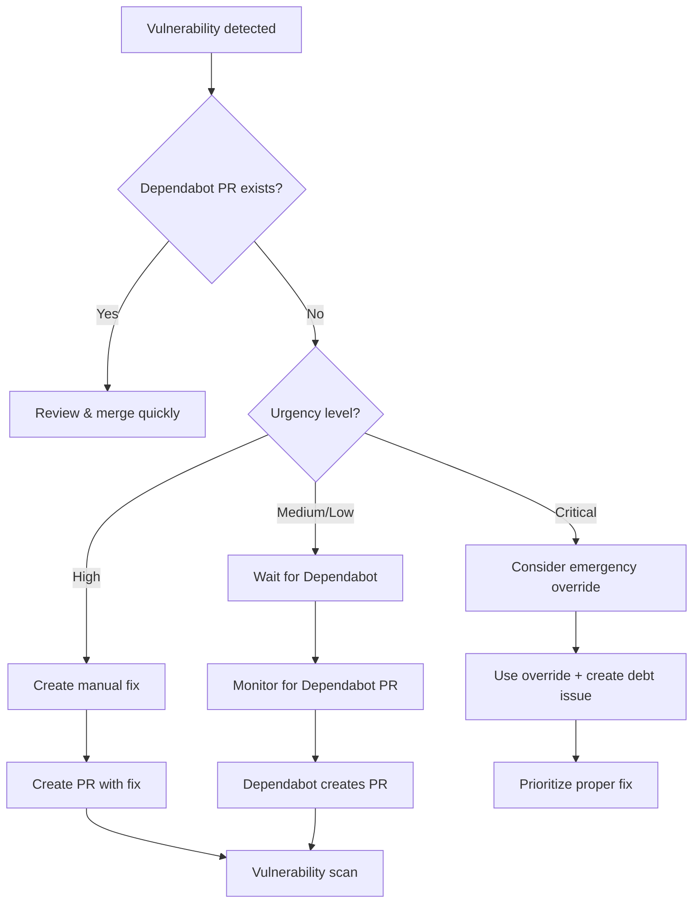

# Dependabot Integration with Vulnerability Scanning

This document provides comprehensive guidance for coordinating Dependabot's automated dependency updates with the mandatory vulnerability scanning system in the Glance project.

## Table of Contents

1. [Overview](#overview)
2. [Current Configuration](#current-configuration)
3. [Interaction Scenarios](#interaction-scenarios)
4. [Coordination Workflows](#coordination-workflows)
5. [Conflict Resolution](#conflict-resolution)
6. [Best Practices](#best-practices)
7. [Troubleshooting](#troubleshooting)

## Overview

The Glance project uses two complementary systems for dependency security:

- **Dependabot**: GitHub's automated dependency update service that creates PRs for outdated dependencies
- **govulncheck**: Go's vulnerability scanner that blocks builds containing HIGH/CRITICAL vulnerabilities

### Integration Goals

1. **Automated Security Updates**: Leverage Dependabot to automatically update vulnerable dependencies
2. **Conflict Prevention**: Avoid scenarios where Dependabot and vulnerability scanning work against each other
3. **Clear Workflows**: Provide developers with clear guidance on handling different scenarios
4. **Audit Trail**: Maintain visibility into all dependency-related security decisions

## Current Configuration

### Dependabot Status

**Configuration**: Default GitHub Dependabot (no explicit `.github/dependabot.yml`)
- ✅ **Enabled**: Evidence from git history shows active Dependabot PRs
- ✅ **Go Modules**: Automatically monitors `go.mod` for updates
- ✅ **Security Updates**: Creates PRs for known vulnerabilities

**Recent Activity Examples**:
```bash
edb5a7a Merge pull request #2 from phrazzld/dependabot/go_modules/golang.org/x/net-0.38.0
ab56cec chore(deps): bump golang.org/x/net from 0.36.0 to 0.38.0
30e5b40 Merge pull request #1 from phrazzld/dependabot/go_modules/golang.org/x/net-0.36.0
e625c45 chore(deps): bump golang.org/x/net from 0.35.0 to 0.36.0
```

### Vulnerability Scanning Configuration

**Configuration File**: `.govulncheck.yaml`
- **Blocking Severities**: HIGH, CRITICAL
- **Non-blocking**: MEDIUM, LOW (advisory only)
- **Timeout**: 300 seconds
- **Scan Level**: symbol (most precise)
- **Triggers**: PR to master, pushes to master, monthly scheduled

## Interaction Scenarios

### Scenario 1: Dependabot Updates Introduce Vulnerabilities

**Situation**: Dependabot creates PR updating dependency to newer version that contains new vulnerabilities

**Current Behavior**:
1. Dependabot creates PR with dependency update
2. PR triggers vulnerability scanning (targets master branch)
3. Scan detects HIGH/CRITICAL vulnerabilities in updated dependency
4. **Build fails** - PR cannot be merged

**Expected Outcome**: ✅ **Correct behavior** - vulnerable dependencies are blocked

**Developer Action Required**:
- Review vulnerability details in scan report
- Either:
  - Wait for Dependabot to create another PR with safer version
  - Manually pin to secure version in separate PR
  - Use emergency override if critically needed (with approval)

### Scenario 2: Dependabot Fixes Vulnerabilities

**Situation**: Existing dependency has vulnerabilities, Dependabot creates PR with fix

**Current Behavior**:
1. Main branch has vulnerable dependency → builds may be failing
2. Dependabot creates PR updating to secure version
3. PR triggers vulnerability scanning
4. Scan passes (vulnerabilities fixed)
5. **Build succeeds** - PR can be merged

**Expected Outcome**: ✅ **Optimal workflow** - automatic vulnerability remediation

**Developer Action Required**:
- Review and approve Dependabot PR promptly
- Merge to restore build stability

### Scenario 3: Vulnerability Detected, Awaiting Dependabot

**Situation**: Vulnerability scanning fails on main branch, team waits for Dependabot fix

**Current Behavior**:
1. Vulnerability discovered in main branch (scheduled scan or new PR)
2. Builds fail due to vulnerability scanning
3. Team waits for Dependabot to create fix PR
4. **Development blocked** until fix arrives

**Timing Considerations**:
- Dependabot typically creates PRs within 24-48 hours of vulnerability disclosure
- Critical vulnerabilities may need immediate action
- Emergency override available for urgent production fixes

**Developer Action Required**:
- Monitor for Dependabot PR creation
- Consider manual fix if:
  - Critical production issue needs immediate deployment
  - Dependabot hasn't responded within reasonable timeframe
  - Fix requires specific version pinning

### Scenario 4: Competing Dependency Updates

**Situation**: Manual dependency update PR and Dependabot PR exist simultaneously

**Potential Conflicts**:
- Multiple PRs updating same dependency
- Different target versions
- Merge conflicts in `go.mod`/`go.sum`

**Resolution Strategy**:
- Prioritize manually created PR (developer has specific reasoning)
- Close Dependabot PR if manual fix is more comprehensive
- Coordinate timing to avoid conflicts

### Scenario 5: Emergency Override with Dependabot

**Situation**: Emergency override used, then Dependabot creates fix PR

**Current Behavior**:
1. Emergency override allows vulnerable code deployment
2. Security debt issue created (48-hour remediation required)
3. Dependabot creates fix PR
4. Fix PR should be prioritized for immediate merge

**Developer Action Required**:
- Merge Dependabot fix immediately
- Close security debt issue
- Document resolution in audit trail

## Coordination Workflows

### Workflow 1: Normal Dependency Updates



### Workflow 2: Vulnerability Response



### Workflow 3: Conflict Resolution

**When multiple dependency PRs exist**:

1. **Identify conflict**: Multiple PRs touching same dependency
2. **Assess approaches**:
   - Compare target versions
   - Evaluate security implications
   - Check for additional changes (beyond version bump)
3. **Choose primary approach**:
   - Manual PR if it includes additional fixes/logic
   - Dependabot PR if it's simple version bump
4. **Close secondary PR**: Comment explaining decision
5. **Proceed with chosen approach**

## Best Practices

### For Developers

**Daily Workflow**:
- Monitor Dependabot PRs in repository
- Review vulnerability scan results promptly
- Prioritize security-related Dependabot PRs

**When Creating Manual Dependency Updates**:
- Check for existing Dependabot PRs first
- Close/reference Dependabot PR in manual PR
- Include rationale for manual approach in PR description

**When Vulnerabilities are Detected**:
- Check for existing Dependabot fix PR first
- If no Dependabot PR exists:
  - Wait 24-48 hours for Dependabot response
  - Create manual fix if urgent or Dependabot is delayed
  - Use emergency override only for critical production issues

### For Repository Maintenance

**Dependabot Configuration** (Future Enhancement):
Create `.github/dependabot.yml` for more control:

```yaml
version: 2
updates:
  - package-ecosystem: "gomod"
    directory: "/"
    schedule:
      interval: "weekly"
      day: "monday"
      time: "09:00"
    commit-message:
      prefix: "chore(deps)"
      include: "scope"
    reviewers:
      - "security-team"
    labels:
      - "dependencies"
      - "security"
```

**Repository Settings**:
- Enable Dependabot security updates
- Configure automatic merge for non-breaking security updates
- Set up branch protection requiring vulnerability scans

### For Security Team

**Monitoring**:
- Track Dependabot PR frequency and success rate
- Monitor emergency override usage patterns
- Review manual dependency update rationales

**Process Improvements**:
- Adjust Dependabot schedule based on vulnerability frequency
- Consider auto-merge for specific security updates
- Update vulnerability scanning thresholds based on experience

## Troubleshooting

### Issue: Dependabot PR Failing Vulnerability Scan

**Symptoms**: Dependabot creates PR but vulnerability scan still fails

**Possible Causes**:
1. Dependency update introduces new vulnerabilities
2. Transitive dependency issues
3. Incomplete fix for complex vulnerability

**Solutions**:
1. **Investigate vulnerability details**:
   ```bash
   # Check specific vulnerabilities
   govulncheck ./...

   # Compare before/after dependency versions
   git diff HEAD~1 go.mod go.sum
   ```

2. **Review vulnerability database**:
   - Check https://vuln.go.dev for dependency details
   - Verify if issue is with direct or transitive dependency

3. **Consider alternatives**:
   - Pin to specific secure version
   - Replace dependency if consistently problematic
   - Use replace directive in go.mod temporarily

### Issue: Dependabot Not Creating Expected PRs

**Symptoms**: Known vulnerabilities exist but no Dependabot PR appears

**Possible Causes**:
1. Dependabot disabled or misconfigured
2. No secure version available
3. Complex dependency constraints preventing update

**Solutions**:
1. **Verify Dependabot status**:
   - Check repository security settings
   - Review Dependabot logs in GitHub UI
   - Confirm go.mod is in supported format

2. **Manual investigation**:
   ```bash
   # Check for available updates
   go list -u -m all

   # Test potential updates
   go get -u dependency@version
   govulncheck ./...
   ```

3. **Create manual fix if needed**:
   - Document reasoning in PR
   - Reference Dependabot behavior in commit message

### Issue: Frequent Merge Conflicts

**Symptoms**: Dependabot PRs frequently have merge conflicts

**Possible Causes**:
1. Multiple dependency update PRs in flight
2. Manual dependency updates conflicting with Dependabot
3. Long-lived feature branches with dependency changes

**Solutions**:
1. **Coordinate timing**:
   - Merge Dependabot PRs quickly
   - Avoid manual dependency updates when Dependabot PR exists
   - Keep feature branches up to date with master

2. **Configure Dependabot schedule**:
   - Reduce frequency if conflicts are common
   - Set specific days/times for updates
   - Group related updates together

## Integration Points

### With Security Scanning Guide

This Dependabot integration guide complements the main [Security Scanning Guide](security-scanning.md):

- **Vulnerability Response**: References emergency override procedures
- **Developer Workflow**: Extends with Dependabot-specific scenarios  
- **Troubleshooting**: Adds Dependabot-related solutions to scanning issues

### With CI/CD Pipeline

Dependabot PRs follow the same CI/CD pipeline as regular PRs:

- Trigger vulnerability scanning
- Subject to same security policies
- Generate audit trails and reports
- Can use emergency override if needed

### With Observability Platform

Metrics to monitor for Dependabot integration:

- **Dependabot PR Success Rate**: Percentage of Dependabot PRs that pass scanning
- **Vulnerability Resolution Time**: Time from detection to Dependabot fix merge
- **Manual vs Automated Fixes**: Ratio of manual dependency fixes to Dependabot fixes
- **Emergency Override Usage**: Frequency of overrides due to dependency issues

## Conclusion

The integration between Dependabot and vulnerability scanning provides a robust automated security update system. Key success factors:

1. **Prompt Response**: Review and merge Dependabot security PRs quickly
2. **Clear Decision Making**: Use documented workflows for conflict resolution
3. **Appropriate Escalation**: Use emergency overrides judiciously for critical issues
4. **Continuous Monitoring**: Track effectiveness and adjust processes as needed

By following these guidelines, the development team can leverage automation for dependency security while maintaining control over critical security decisions.

---

**Related Documentation**:
- [Security Vulnerability Scanning Guide](security-scanning.md)
- [GitHub Actions Workflows](github-actions.md)
- [Emergency Override Procedures](security-scanning.md#emergency-override-procedures)
